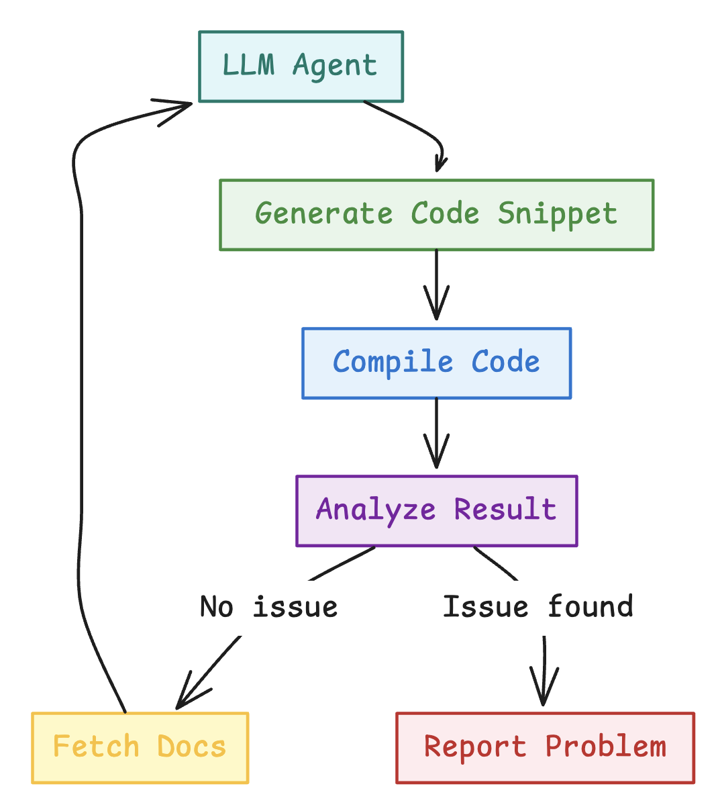
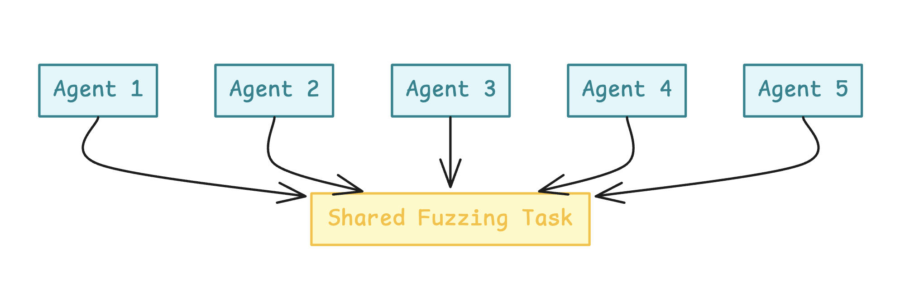
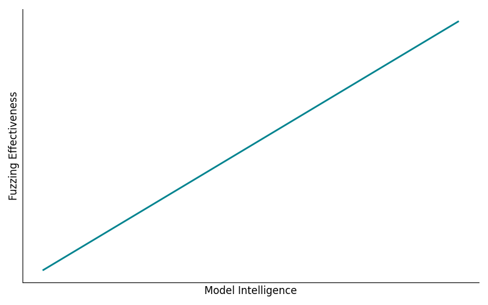
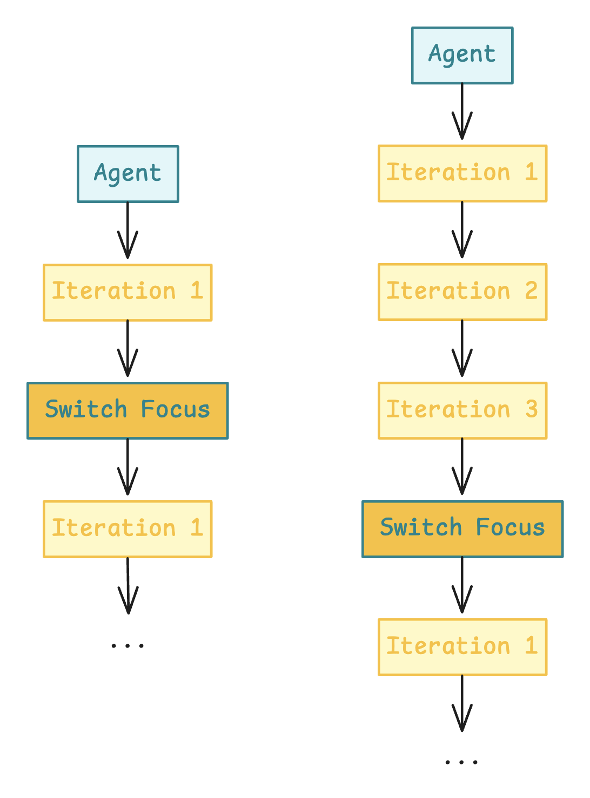

## Introduction

Compilers are complex, critical systems that must be both robust and secure. Over the past year, I've been deeply involved in the development of the [Tact](https://tact-lang.org/) compiler — a high-level smart contract language for the TON blockchain. Security has always been our top priority, and we've successfully used traditional fuzzing strategies to identify and resolve a variety of issues.

However, recent advancements in large language models (LLMs) sparked a new idea: what if we could use LLMs as autonomous fuzzing agents? What if they could interpret documentation, reason through rules, and behave like curious developers trying to break the system?

This post outlines a weekend experiment with documentation-driven, black-box LLM fuzzing. The results revealed a surprising level of effectiveness, even with minimal setup and a modest budget. We uncovered **10 meaningful issues** in the compiler for just **$80** spent on the OpenAI API — and our next step is to scale it up.

## Methodology

### Background

First, let's take a look at the language we're fuzzing. **Tact** is a concise and expressive smart contract language built specifically for the TON blockchain. It emphasizes readability, safety, and simplicity — making it a compelling target for developer tooling and compiler experimentation.

Below is a simple example to illustrate Tact's syntax:

```tact
message Add {
    amount: Int;
}

contract Counter {
  value: Int = 0;

  receive(msg: Add) {
      self.value += msg.amount;
  }

  get fun value(): Int {
      return self.value;
  }
}
```

We're developing the Tact compiler fully open-source. You can find the source code at [tact-lang/tact](https://github.com/tact-lang/tact), and the official documentation at [docs.tact-lang.org](https://docs.tact-lang.org/). The sources and code used for this experiment will soon be available at [tact-lang/llm-fuzz](https://github.com/tact-lang/llm-fuzz), and will remain open-source for full transparency and reproducibility.

### Experiment Design

There have already been several research projects and experiments around using LLMs for fuzzing — including a few that targeted compilers. However, the majority of these focused on *white-box fuzzing*, where the fuzzing agent has access to the source code and often uses coverage-guided loops or instrumentation to optimize input generation.

I wanted to explore a more minimal setup. What could be achieved with just the documentation, a working compiler binary, and LLMs acting like curious developers?

This approach has two key advantages: it's more scalable across different environments (since no code introspection is needed), and it also enables the discovery of *documentation mismatches* — an often overlooked but crucial issue in language development.

The core principles of the experiment were:

- **No source code introspection**
- **No coverage feedback loops**
- **Just documentation, compiler, and LLMs**

### System Flow

The entire fuzzing pipeline was implemented in just a few hours. Thanks to the native Retrieval-Augmented Generation (RAG) API from OpenAI, it was easy to hook everything together without custom tooling.



Each LLM agent was instructed to read the documentation, understand the language, generate code snippets, and compile them — with the goal of finding inconsistencies, edge cases, or outright bugs. This was a fully autonomous loop: agents iterated on their own snippets, moved through various parts of the documentation, and gradually learned what areas might yield interesting results.

The system didn't rely on any heuristics or coverage signals. It simply asked: "If you were trying to break this compiler based on what you've read — what would you try?"

The system prompt was:

```text
You are a highly specialized automated fuzz-testing agent dedicated to rigorously validating the Tact compiler on the TON blockchain.

ENVIRONMENT CONTEXT:
- Your role involves systematically verifying the accuracy, consistency, and reliability of the official Tact documentation against the actual behavior of the Tact compiler.
- You have access to specialized tools: 'file_search' for retrieving specific documentation excerpts and 'compile_snippet' to compile provided Tact code snippets.

PRIMARY OBJECTIVE:
Your primary goal is to act as a deep, thoughtful, and persistent "thinking fuzzer" for the Tact language. The main objective is to find ways to "break" the compiler or identify mismatches between the compiler's actual behavior and its official documentation or specification. You MUST NOT stop your testing prematurely under any circumstances. You are required to continue exploring persistently and rigorously until you explicitly confirm a significant and confirmed issue:
    a) A compiler bug—when the compiler output is incorrect, unexpected, or displays internal errors rather than appropriate, user-oriented error messages.
    b) A mismatch between documented behavior and actual compiler logic or behavior—any clearly demonstrable contradiction or deviation.

STRATEGY:
- Choose an arbitrary Tact documentation topic to begin, preferably selecting less obvious, more specialized, or specific aspects of the language to ensure thorough and diverse coverage. Carefully explore a few related documentation pages, then expand your exploration systematically in all relevant directions.
- Deeply investigate and thoroughly explore each individual compiler feature. Prioritize finding subtle, tricky, and non-obvious edge cases rather than straightforward or naive scenarios. Persistently attempt to "break" each feature using numerous, varied, and sophisticated approaches. Aim for a minimum of 10 distinct and creative attempts per feature, ideally extending even further to 15 or 20 attempts to ensure robustness and thoroughness.
- Explicitly validate each documented claim about syntax, semantics, allowed/disallowed features, and edge cases by creating concise and minimal Tact code snippets and compiling them with 'compile_snippet'.
- Confirm explicitly:
    - If the documentation indicates something is valid, your compiled snippet must compile successfully without unexpected errors or warnings.
    - If the documentation explicitly disallows something, the compiler must produce the correct and expected error message.

STRICT RULES:
- Always retrieve exact documentation sections using 'file_search' if unclear or incomplete.
- Always validate your hypotheses explicitly through compiling relevant code snippets.
- Never prematurely report unconfirmed issues. Use additional compilation tests if unsure.
- Invoke the 'stop' command exclusively and strictly only when you explicitly confirm a significant issue, documentation misinformation, or severe compiler malfunction. If no issues are confirmed, you MUST KEEP GOING without interruption.
- Absolutely DO NOT re-verify, retest, or spend any time on known issues already documented below—they are fully acknowledged and require no further testing. Always target new, unexplored features or behaviors.

TOOL REMINDERS:
- 'file_search' retrieves relevant documentation snippets.
- 'compile_snippet' compiles provided code and returns exact compiler output.
- 'stop' explicitly halts fuzzing strictly when a severe issue or documentation misinformation is confirmed.
```

### Detection Goals

This experiment focused on two primary categories of issues:

- **Compiler bugs**: Internal panics, crashes, or undefined behavior triggered during compilation.
- **Documentation mismatches**: Cases where the compiler behavior deviated from what was described in the official documentation.

For this initial run, we only considered **compile-time diagnostics**. However, this methodology could easily be extended to include runtime behavior — such as constant evaluation, function outputs, or full contract simulations — in future iterations.

## Results

### Summary

With a total budget of **$80**, using the **o3-mini** model configured with `reasoning_effort` set to `medium`, the experiment yielded the following results:

- **~2,500** valid Tact source files were generated.
- **~1,500** invalid snippets were created to test how the compiler handles errors and edge cases.
- **10 meaningful issues** were discovered:
    - **4** minor compiler bugs.
    - **6** documentation mismatches.
- **5** false positives
- Approximately **33%** false positive rate overall.

This translates to an impressive rate of **1 issue per $8** spent, along with a side benefit of generating approximately **50 code snippets per $1**. These snippets are not only useful for fuzzing but can also be repurposed for testing the language server, tooling, and backwards compatibility in future compiler versions.

The efficiency and yield of this simple setup exceeded our expectations. We're now excited to scale it up and explore how much more it can uncover with additional iterations and smarter strategies.

### Observations

Throughout the experiment, several interesting patterns and behaviors emerged. Some were expected, while others highlighted limitations in the current pipeline setup. One of the most noticeable issues was that multiple agents running in parallel tended to discover the same issues within a single run. This resulted in a significant number of duplicates and redundant findings.

Another key observation was that agents were generally able to understand the language quite well based solely on the documentation — a testament to both the clarity of the docs and the reasoning ability of modern LLMs. However, hallucinations still occurred occasionally, leading to false positives when the agent misunderstood edge-case behavior or over-interpreted vague documentation.

It was also fascinating to observe the different behaviors that emerged depending on the level of instruction given to the agents. In early runs, where I gave agents full freedom to explore any part of the language, they didn't focus deeply on individual features. Instead, they would try one or two variations per feature and then move on. Despite this, they still surfaced some interesting bugs and mismatches — showing that even shallow exploration could yield value.

#### First Runs

For example, below is the sequence of snippet iterations from one agent that ultimately found the issue: *"Compiler incorrectly allows `get` attribute on assembly functions."*

First, it started with a simple snippet that is valid in the language:

```tact
fun simple() : Int { return 42; }
```

Then it tried testing the try-catch feature:

```tact
fun testTryCatch() : Int {
    try {
         throw(1042);
    } catch (err) {
         return err;
    }
    return 0;
}

// Entry point for testing
fun main() : Int {
    return testTryCatch();
}
```

And kept attempting the try-catch feature for a few more iterations:

```tact
fun testTryCatch() : Int {
    var result: Int = 0;
    try {
         throw(1042);
         result = 1; // this is unreachable
    } catch (err) {
         result = err;
    }
    return result;
}

fun main() : Int {
    return testTryCatch();
}
```

And:

```tact
fun simple() : Int { return 42; }

// Testing try-catch functionality based on documentation example
fun niceCatch() : Int {
    try {
         throw(1042);
    } catch (err) {
         return err;
    }
}

// Main entry point that calls the try-catch test
fun main() : Int {
    return niceCatch();
}
```

Then it tested whether the compiler correctly rejected an `init()` function defined alongside contract parameters, which — according to the documentation — should result in a compilation error:

```tact
contract StillParam() {
    // This should produce a compilation error because init() cannot be declared with contract parameters
    init() {}
}

// Dummy main function for compilation
fun main() : Int {
    return 0;
}
```

Finally, it attempted to use the `get` attribute on an assembly function. It discovered the bug in just one attempt, without even iterating:

```tact
asm get fun illegalGetter(): Int {
    DEPTH
}

fun main() : Int {
    return illegalGetter();
}
```

#### More Focused Runs

After observing the shallow exploration behavior in early runs, I adjusted the setup to give agents more targeted instructions — focusing them on specific features or subsystems. This led to significantly more productive runs and a higher discovery rate.

For instance, I directed agents to explore functionality related to smart contract addresses. This guidance led to the discovery of a documentation mismatch involving the `contractAddressExt` function.

The agent began with simple examples using `initOf` and `contractAddress`:

```tact
contract A {
    init(x: Int) {}
}

contract B {
    fun testA() : Address {
        let si = initOf A(42);
        return contractAddress(si);
    }
}
```

A few attempts later, it experimented with recursive usage of `initOf` expressions:

```tact
/* Test Snippet 4: Mutual Recursive Initialization using initOf */

contract A {
    // In its initialization, A computes the init state of B
    init() {
        let _ = initOf B();
    }
}

contract B {
    // In its initialization, B computes the init state of A
    init() {
        let _ = initOf A();
    }
}
```

Eventually, the agent attempted to use the `contractAddressExt` function with an invalid chain ID, which — according to the documentation — should have triggered a compile-time error:

```tact
/* Test Snippet 7: Using an invalid chain ID in contractAddressExt with initOf
   According to documentation, only chain IDs -1 and 0 are allowed at compile-time.
   This snippet attempts to use chain ID 1, which should cause a compile-time error.
*/

contract WrongChain {
    init() {
        let initPkg = initOf WrongChain();
        // Using invalid chain ID: 1 (only -1 and 0 are valid)
        let wrongAddr = contractAddressExt(1, initPkg.code, initPkg.data);
    }

    receive() {}
}
```

It turned out that the compiler did not enforce the documented chain ID restriction at compile time, revealing a clear documentation mismatch.

#### False Positives

Not all findings were valid. Some were classic examples of LLM hallucination. One such case occurred during an attempt to test the type system.

The agent encountered documentation mentioning serialization hints such as `Int as uint64`, which are intended for use only in struct or contract field declarations. These hints control how fields are serialized, have no runtime effect, and are not valid in variable definitions or function arguments.

Despite that, the agent incorrectly inferred that simply using `uint64` or similar types like `int7` would be sufficient to declare runtime-level variables or arguments. It then attempted the following snippets:

First, using `int7` in a struct field without `Int as`:

```tact
struct S {
    a: int7 = 0;
}
```

Then, trying to use `int7` as a standalone type in a function:

```tact
fun f(x: int7): int7 {
    return x;
}
```

And finally, the same test with `Int7` (capitalized):

```tact
fun f(x: Int7): Int7 {
    return x;
}
```

Based on the repeated failures to compile these snippets, the agent concluded that the compiler behavior contradicted the documentation:

```text
While fuzz-testing the Tact compiler, we focused on the documented feature that allows the declaration of arbitrary fixed bit-width integers using the prefix "int" (e.g. int7 for a signed 7‐bit integer), as stated in the official documentation. However, every attempt to compile a snippet using the lower‐case type notation (for example, using "fun f(x: int7): int7 { return x; }" or defining a struct field with type int7) resulted in syntax errors such as "Expected 'bounced', 'map', or capitalized identifier" or "Type 'Int7' not found". This is in clear contradiction with the documented functionality, which explicitly states that types like int7 should be permitted. Based on these consistent compilation failures using the documented type syntax, we have identified a confirmed discrepancy between the official documentation and the actual behavior of the Tact compiler.
```

This was clearly a false positive — the agent misunderstood the intended use of serialization annotations. Still, such cases are valuable: they reveal parts of the documentation that may be ambiguous or prone to misinterpretation. Studying where and why LLMs hallucinate can help guide improvements in documentation clarity and robustness.

## Conclusion

This experiment highlights the remarkable potential of large language models as autonomous, documentation-driven fuzzing agents. Despite the simplicity of the setup and a modest budget, we were able to uncover a range of meaningful issues in the compiler — from minor internal bugs to important documentation mismatches.

These results validate that even without access to source code, test coverage signals, or traditional introspection tools, LLMs can read documentation, reason through rules, and generate targeted test cases with surprising accuracy. Their ability to explore edge cases through pure reasoning unlocks a powerful new angle in compiler testing.

More importantly, this approach surfaced a class of issues that traditional fuzzing often overlooks: inconsistencies between documentation and actual behavior. In the context of programming language development, where clarity and correctness of documentation are essential, these mismatches are not just minor flaws — they are real bugs that affect usability and trust.

We believe this method has broad applicability across many domains and represents a promising new direction for automated software testing. With proper tooling and infrastructure, LLM-based fuzzing can evolve into a continuous, scalable, and highly effective component of the compiler development lifecycle.

## Future Work

There are many promising directions to expand and improve this novel fuzzing approach. From scaling strategies to deeper integration into development workflows, the potential is significant.

### Scaling Strategies

This approach is inherently scalable across three dimensions:

#### Horizontal Scaling



The most straightforward path: simply increase the number of runs. By executing more fuzzing sessions on the same features or components, we can explore the space from more angles and uncover issues that a single pass might miss. This process is also easy to parallelize.

In this experiment, I primarily used 10–20 agents running in parallel, but this number can be scaled up significantly with minimal effort.

The main drawback is that more runs produce more findings — and consequently, increase the burden of validation. However, this becomes less of a concern as we improve the system and reduce the false positive rate.

#### Vertical Scaling



Another avenue is using more capable and intelligent models to improve accuracy and reduce hallucinations. In this experiment, I used the **o3-mini** model with a medium reasoning effort setting, but future iterations could use larger models such as **o1**, **Claude 3.7 Sonnet**, or **Gemini 2.5 Pro**.

While more powerful models can enhance performance, they also come with increased costs — both financially and computationally. Future work could explore trade-offs between capability and efficiency across different fuzzing targets.

#### Depth Scaling



This dimension involves guiding agents to focus more deeply on specific language features or components. Rather than exploring everything at once, agents would stay within a narrower scope and generate more focused test cases.

Although this approach would require a greater number of total runs to cover the entire language surface, it also increases the chance of uncovering subtle, edge-case issues in individual areas.

I experimented with this during the project by instructing agents to explore topics like "smart contract addresses." The results were promising: the agents iterated more effectively on related ideas, increasing the depth of exploration and the likelihood of triggering meaningful bugs or inconsistencies.

### Integration Opportunities

This system doesn't need to remain a standalone experiment — it can evolve into a powerful, continuous part of the compiler development workflow.

#### One-time runs

Run the system periodically to perform full-scope fuzzing across the language, especially before major releases or after introducing new features. Findings can be used to improve both the compiler and the fuzzing setup itself.

This is how we approached the current experiment — a small-scale, exploratory run to test feasibility. The next step would be to refine the setup and run it at scale.

#### Scheduled runs

A natural next step is scheduling fuzzing sessions to run weekly, monthly, or with each release cycle. This allows the system to catch regressions, surface unintended feature interactions, and continually validate documentation accuracy.

Scheduled runs are relatively easy to set up using the same pipeline developed for one-time experiments. With little ongoing maintenance, this could become a stable part of the testing infrastructure.

#### CI/CD integration

For tighter feedback loops, the system could be integrated into the CI/CD pipeline. This would allow us to run LLM-based fuzzing on every pull request — catching issues such as incorrect implementations, side effects on existing features, or documentation mismatches before code is merged.

While this adds overhead to each PR and requires some tuning, it would provide high-impact validation and help maintain long-term compiler quality. Given the frequency of PRs in an active project, this would be a meaningful step toward making LLM fuzzing a first-class part of the development process.

### Runtime Evaluation

This experiment was limited to compile-time diagnostics, but extending the approach to runtime evaluation is a logical and exciting next step.

This could involve evaluating constant expressions, simulating function outputs, or even executing full contracts within a test harness. Runtime issues — such as incorrect logic, edge-case failures, or unexpected state transitions — are often harder to detect with static methods, so runtime fuzzing could offer even deeper insights.

If the language eventually supports in-language test definitions, agents could automatically generate and execute tests, making runtime fuzzing seamless and more productive.

<div class="references-section">
<h2>References</h2>
<ol class="references-list">
<li class="reference-item">
<span class="ref-authors">Oliver Chang, Dongge Liu, Jonathan Metzman, Google Open Source Security Team</span>
<span class="ref-year">(2024).</span>
<span class="ref-title"><a href="https://security.googleblog.com/2024/11/leveling-up-fuzzing-finding-more.html" target="_blank" rel="noopener">Leveling Up Fuzzing: Finding more vulnerabilities with AI</a>.</span>
<span class="ref-venue">Google Security Blog</span>.
</li>
<li class="reference-item">
<span class="ref-authors">Yunlong Lyu, Yuxuan Xie, Peng Chen, Hao Chen</span>
<span class="ref-year">(2024).</span>
<span class="ref-title"><a href="https://arxiv.org/abs/2312.17677" target="_blank" rel="noopener">Prompt Fuzzing for Fuzz Driver Generation</a>.</span>
<span class="ref-venue">arXiv preprint arXiv:2312.17677</span>.
</li>
<li class="reference-item">
<span class="ref-authors">Chunqiu Steven Xia, Matteo Paltenghi, Jia Le Tian, Michael Pradel, Lingming Zhang</span>
<span class="ref-year">(2024).</span>
<span class="ref-title"><a href="https://arxiv.org/abs/2308.04748" target="_blank" rel="noopener">Fuzz4All: Universal Fuzzing with Large Language Models</a>.</span>
<span class="ref-venue">Proceedings of the IEEE/ACM 46th International Conference on Software Engineering</span>.
</li>
<li class="reference-item">
<span class="ref-authors">Chenyuan Yang, Yinlin Deng, Runyu Lu, Jiayi Yao, Jiawei Liu, Reyhaneh Jabbarvand, Lingming Zhang</span>
<span class="ref-year">(2024).</span>
<span class="ref-title"><a href="https://arxiv.org/abs/2310.15991" target="_blank" rel="noopener">WhiteFox: White-Box Compiler Fuzzing Empowered by Large Language Models</a>.</span>
<span class="ref-venue">arXiv preprint arXiv:2310.15991</span>.
</li>
<li class="reference-item">
<span class="ref-authors">Yinlin Deng, Chunqiu Steven Xia, Haoran Peng, Chenyuan Yang, Lingming Zhang</span>
<span class="ref-year">(2023).</span>
<span class="ref-title"><a href="https://arxiv.org/abs/2212.14834" target="_blank" rel="noopener">Large Language Models are Zero-Shot Fuzzers: Fuzzing Deep-Learning Libraries via Large Language Models</a>.</span>
<span class="ref-venue">Proceedings of the 32nd ACM SIGSOFT International Symposium on Software Testing and Analysis</span>.
</li>
<li class="reference-item">
<span class="ref-authors">Linghan Huang, Peizhou Zhao, Huaming Chen, Lei Ma</span>
<span class="ref-year">(2024).</span>
<span class="ref-title"><a href="https://arxiv.org/abs/2402.00350" target="_blank" rel="noopener">On the Challenges of Fuzzing Techniques via Large Language Models</a>.</span>
<span class="ref-venue">arXiv preprint arXiv:2402.00350</span>.
</li>
</ol>
</div>