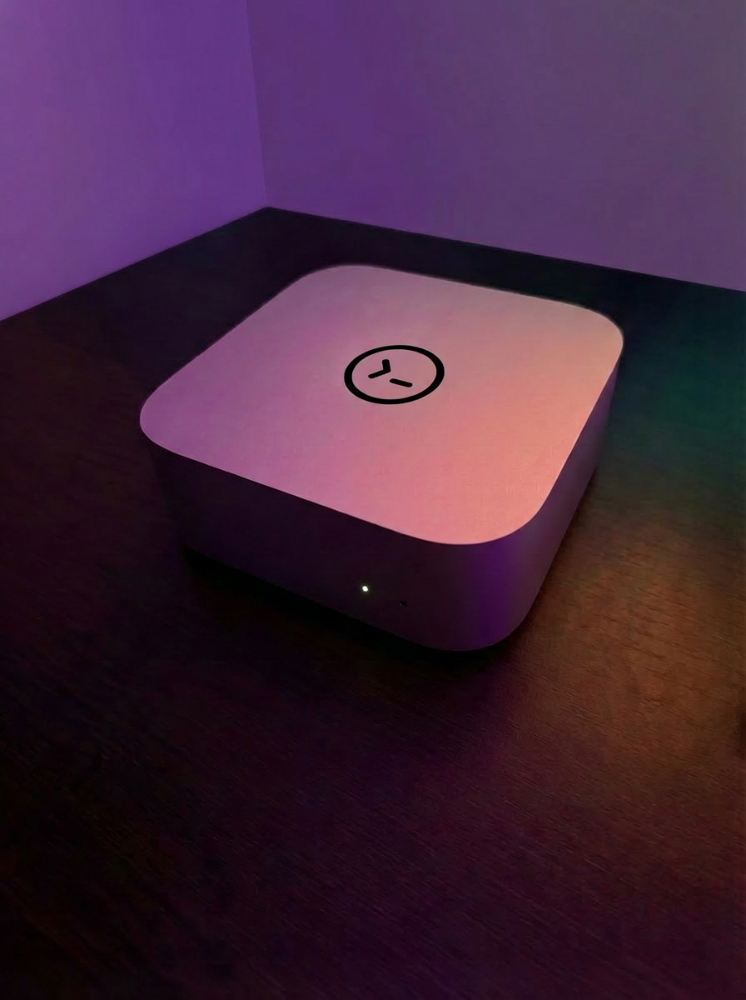

I was playing around with Codex CLI a lot over the holidays, and apart from making it run 30 instances of itself as "subagents" (actually just doing `codex exec` runs in background terminals) I also decided to buy a fresh Mac Mini and give it to Codex.

I quickly implemented a pretty simple setup, that consists of a **Codex caller** that controls Codex process and that forces it to run in an endless loop, and a **Telegram bot** through which I interact with the agent.

The setup was the easiest part to implement and I actually spent about 20x more time on writing first working versions of prompts with Claude. Prompts are everything here.

I decided to use Codex here with GPT-5.2 model on Extra High reasoning effort, as that is the best model available in terms of instruction following and long context. Earlier I saw it run for 3 hours doing 4 compactions in the process and still delivering a good result for a non-trivial problem.

The instruction following is essential in this experiment as the agent must reliably interact with me and follow all the guidance I gave it about using the computer, interacting with me and keeping notes.

Long-context accuracy is the second most important part, as this agent will run endlessly for days, weeks, or maybe months. Working on a specific problem for a few hours is much simpler than delivering consistently good (and even improving) results for a week straight without resets.

I won't explain too much about the setup, but the core here was giving agent a lot of context about [who, where, when, and how] it is, and instructing it to take notes. A lot of notes. All the time.

I'll be using this agent as an assistant for some time. It's nice to be able to message it from my phone and ask it to push some change in a repository. Or ask it to research something overnight using ChatGPT in a browser.

I'll probably stop the experiment if I don't find it useful over multiple days in a row. In this case I'll just wait for the next version of GPT and try again.

Whether it turns out to work great or not, I'll post an update later.
