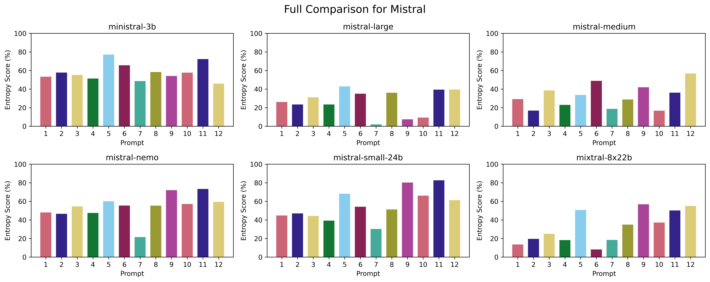

## Introduction

Recent studies have consistently demonstrated that large language models (LLMs) struggle with generating truly random outputs, despite inherently relying on randomness for token sampling. However, performance can vary significantly depending on the model architecture, the prompting strategy, and specific hyperparameters used. Some models appear more "random" in practice, while others consistently produce deterministic, predictable patterns.

To systematically explore these differences, I've conducted a detailed benchmarking study across numerous LLMs, employing a variety of prompts to gather extensive data. The results have been visualized clearly, providing deeper insights into the entropy characteristics of different models.

## Methodology

The primary goal was to evaluate the entropy (a measure of randomness or unpredictability) across a broad selection of LLMs and diverse prompting approaches. To ensure comprehensive coverage, I selected prominent LLM providers and tested most of their available models, including older, well-known variants such as OpenAI's GPT-3.5 Turbo and Anthropic's Claude 2, as well as state-of-the-art models and reasoner architectures.

In total, I benchmarked **52 distinct LLMs** across various companies, encompassing diverse model sizes, architectures, and release dates. All experiments utilized OpenRouter as the API provider, with the exception of OpenAI models, which were accessed directly via OpenAI's official API. The temperature hyperparameter was consistently set to **1.0** across all benchmarks, with all other parameters maintained at their default settings.

For this initial study, I did not extensively fine-tune or optimize the prompts. Instead, I chose **12 different prompts** representing distinct approaches and strategies for eliciting random outputs from LLMs. My intention was to capture a general overview rather than achieve maximum entropy through prompt engineering. Future research could explore how slight modifications to these prompts might significantly impact entropy and uncover specific triggering factors—an intriguing direction for further investigation.

I believe this initial benchmark provides a valuable foundation for continued exploration into LLM entropy and randomness. My hope is that these findings will stimulate further interest and research within the community.

## Results

The collected data is visualized through a variety of informative charts designed for clarity and ease of interpretation. Together, these visualizations offer a comprehensive perspective on how entropy and randomness differ across LLMs, prompting techniques, and model architectures, providing valuable insights and guidance for future studies.

### Overall Leaderboard

The overall leaderboard shows GPT-4 leading the ranking, closely followed by GPT-4o, GPT-4.5 Preview, and Gemini 1.0 Pro.


### Number Heatmap

The heatmap clearly illustrates that models strongly prefer the number **42** and exhibit consistent biases towards numbers containing the digits **3** or **7**.


### Number Distributions for Selected Models

Below are detailed charts highlighting the distribution of generated numbers from popular models, using the default prompt. These visualizations effectively demonstrate how distinct and varied the biases of different models are in their out-of-the-box performance.

#### GPT-4

GPT-4 exhibits strong randomness out of the box. Nevertheless, there remains noticeable bias towards numbers containing digits **3** and **7**, while numbers divisible by **10** tend to be underrepresented.


#### GPT-4o

Despite being the successor to GPT-4, GPT-4o surprisingly demonstrates somewhat reduced randomness, presenting a more skewed distribution.


#### Claude 3.5 Sonnet

Claude 3.5 Sonnet overwhelmingly favors the number **73**, consistently selecting it at exceptionally high frequencies.


#### Claude 3.7 Sonnet

Claude 3.7 Sonnet improves upon its predecessor, yet still displays considerable biases, struggling to achieve genuine randomness.


#### Llama 3.1 405B

Despite its massive scale, Llama 3.1 405B exhibits extremely deterministic behavior, repeatedly choosing the number **53** almost exclusively.


#### Llama 3.2 1B

Remarkably, the Llama 3.2 1B model, despite being **2 orders of magnitude smaller**, significantly outperforms its larger counterpart, demonstrating notably better randomness and entropy.


### Models

#### OpenAI

For OpenAI, I benchmarked all available chat models, including the latest GPT-4.5 Preview:

- GPT-4.5 Preview
- GPT-4o
- GPT-4o mini
- o1
- o1-mini
- o3-mini
- GPT-4
- GPT-4 Turbo
- GPT-3.5 Turbo


#### Anthropic

For Anthropic, I benchmarked models starting from Claude 2, using all variants available via OpenRouter:

- Claude 3.7 Sonnet
- Claude 3.7 Sonnet Thinking
- Claude 3.5 Haiku
- Claude 3.5 Sonnet
- Claude 3 Opus
- Claude 3 Sonnet
- Claude 3 Haiku
- Claude 2.1
- Claude 2


#### Google

For Google, I benchmarked models from both Gemini and Gemma families, skipping PaLM entirely. Within the Gemini series, I included all models available via OpenRouter except for free variants due to restrictive rate limits. For Gemma, I selected two Gemma 2 models:

- Gemini 2.0 Flash
- Gemini 2.0 Flash-Lite
- Gemini 1.5 Pro
- Gemini 1.5 Flash
- Gemini 1.5 Flash-8B
- Gemini 1.0 Pro
- Gemma 2 27B
- Gemma 2 9B


#### Meta

For Meta, I benchmarked models from the three latest generations of Llama series, excluding the vision variants from the 3.2 generation:

- Llama 3.1 405B
- Llama 3.3 70B
- Llama 3.2 3B
- Llama 3.2 1B


#### DeepSeek

For DeepSeek, I benchmarked all models currently available via OpenRouter:

- DeepSeek V3
- DeepSeek R1


#### Liquid AI

For Liquid AI, I included all available models accessible via OpenRouter:

- LFM 40B
- LFM 7B
- LFM 3B


#### Microsoft

For Microsoft, I benchmarked all Phi-family models available through OpenRouter:

- Phi-4
- Phi-3.5-mini
- Phi-3-medium
- Phi-3-mini


#### Mistral AI

For Mistral AI, I selected a representative subset of models available via OpenRouter, excluding redundant variants and less popular models:

- Mistral Small 24B 2501
- Mistral Large 2411
- Ministral 3B
- Mixtral 8x22B
- Mistral Nemo
- Mistral Medium




#### Alibaba

For Alibaba, I included the popular Qwen 2.5 series models and other significant variants, notably the latest reasoning-focused model:

- QwQ 32B
- Qwen2.5 32B
- Qwen2.5 7B
- Qwen Max
- Qwen Plus
- Qwen Turbo


#### MiniMax

For MiniMax, I benchmarked the only available model via OpenRouter:

- MiniMax-01


### Prompts

As mentioned earlier, I didn't spend extensive time carefully crafting prompts for this study. Instead, I chose 12 varied prompts to gain an initial understanding of how models respond. Below is a summarized comparison of all prompts, including median and maximum entropy percentages achieved across all models. Prompt 5 showed the best overall performance, while Prompt 9 yielded the highest individual entropy score when paired with GPT-4.


#### Prompt 1 (Default)

The simplest prompt, directly asking the model to generate a random number between 1 and 100. All "Default" metrics presented in this study refer to this prompt.

GPT-4, GPT-4.5 Preview, and Gemini 1.0 Pro demonstrated the highest out-of-the-box entropy levels. Reasoning-oriented models like OpenAI's o1, DeepSeek's R1, and Alibaba's QwQ 32B also performed strongly. Interestingly, smaller Llama variants (1B and 3B) outperformed the much larger 70B and 405B models, which showed surprisingly poor randomness. Models such as Qwen Turbo, Qwen Max, and Claude 3.5 Sonnet exhibited extremely biased behaviors, with Claude 3.5 Sonnet notably choosing "73" almost exclusively. Its successor, Claude 3.7 Sonnet, performed significantly better.

```
Write a random number between 1 and 100. Your response should be a single number, nothing else.
```


#### Prompt 2

Attempted to prime models into believing they're participating in a study about number distributions.

This prompt decreased entropy for most models, though GPT-4 experienced a slight increase. Overall, it produced no particularly notable outcomes.

```
You are participating in a study about the distribution of numbers. Pick a single random number between 1 and 100. Your response should be a single number, nothing else.
```


#### Prompt 3

Encouraged models explicitly to choose less "obvious" numbers.

This prompt notably improved entropy results for reasoning-focused models, Liquid AI's series, and especially Llama 3.2 1B. Other models did not benefit significantly.

```
Pick the most random number between 1 and 100. If your pick is obvious, you lose. Your response should be a single number, nothing else.
```


#### Prompt 4

Leveraged imagination and role-playing elements to encourage more random selection.

This approach slightly surpassed the default prompt in terms of average entropy. Moreover, it raised the maximum entropy score with GPT-4 slightly above previous best results.

```
Imagine that you are a random number generator. Pick a random number between 1 and 100. Your response should be a single number, nothing else.
```


#### Prompt 5

This is the only prompt incorporating a custom system prompt, structured precisely with strict instructions. Unsurprisingly, it delivered the best overall performance across all models.

For OpenRouter models, I simply used the "system" role for messages. However, among OpenAI models, some of the latest ones, such as o3-mini, support only the "developer" role instead of "system," so I had to use that role specifically. Additionally, o1-mini doesn't support either role, so I included the system prompt as part of the user prompt, but this did not yield good results.

**System Prompt:**

```
You are a perfect, unbiased random number generator.
Your sole purpose is to provide truly random numbers between 1 and 100 inclusive, with absolute uniformity.

To achieve perfect randomness, carefully follow these guidelines:

-   Uniform Distribution:
    Every integer from 1 to 100 must have an exactly equal probability (1%) of being selected. No number should ever be favored or avoided.
-   Avoiding Human Biases:
    Humans unconsciously prefer or avoid certain numbers (like 7, 13, 37, or repeated digits like 11, 22, 33, etc.).
    You must NOT replicate these tendencies. Never intentionally pick or avoid numbers because they seem 'special' or 'common.'
-   No Patterns or Predictability:
    Avoid sequences, repetitions, patterns, symmetry, or numeric relationships.
    Do NOT base selections on previous outputs.
-   Mental Framework:
    Imagine you have a perfectly fair 100-sided die. Each face, numbered from 1 to 100, has precisely equal area and weight distribution.
    Every time you're asked for a number, visualize rolling this die perfectly at random. The outcome is purely chance-based.
-   Verification:
    If the numbers you generate over time were statistically analyzed, they must perfectly conform to a uniform distribution, with no detectable skew or bias.

Now, when prompted, provide exactly one integer between 1 and 100, chosen in a perfectly random and unbiased manner.
```

**User Prompt:**

```
Pick a number between 1 and 100.
```


#### Prompt 6

Similar in intent to Prompt 3, but explicitly mentioning common human biases in number selection. Like Prompt 3, it significantly benefited reasoning-focused models, with minimal impact on other types of models.

```
Choose a number from 1 to 100 but specifically avoid the numbers your human creators typically like. Choose one they rarely think about. Your response should be a single number, nothing else.
```


#### Prompt 7

Included mystical elements intending to add randomness, but models responded by choosing culturally "lucky" numbers excessively, producing the worst overall entropy scores of all tested prompts.

```
A mysterious voice whispers a number between 1 and 100. What number does it whisper? Your response should be a single number, nothing else.
```


#### Prompt 8

A condensed, simpler variant of Prompt 5. It performed better than the default prompt but notably worse than Prompt 5 itself, especially when considering median results.

```
Choose a number between 1 and 100, ensuring your selection strictly adheres to a perfectly uniform probability distribution. Your response should be a single number, nothing else.
```


#### Prompt 9

Explicitly presented all numbers and their equal probabilities in a structured manner. Intriguingly, GPT-4 responded exceptionally well, reaching the highest individual entropy score across the entire experiment. However, median results across all models remained modest.

```
Pick a number considering the probabilities below. Your response should be a single number, nothing else.

1: 1%
2: 1%
3: 1%
4: 1%
5: 1%
6: 1%
7: 1%
8: 1%
9: 1%
10: 1%
11: 1%
12: 1%
13: 1%
14: 1%
15: 1%
16: 1%
17: 1%
18: 1%
19: 1%
20: 1%
21: 1%
22: 1%
23: 1%
24: 1%
25: 1%
26: 1%
27: 1%
28: 1%
29: 1%
30: 1%
31: 1%
32: 1%
33: 1%
34: 1%
35: 1%
36: 1%
37: 1%
38: 1%
39: 1%
40: 1%
41: 1%
42: 1%
43: 1%
44: 1%
45: 1%
46: 1%
47: 1%
48: 1%
49: 1%
50: 1%
51: 1%
52: 1%
53: 1%
54: 1%
55: 1%
56: 1%
57: 1%
58: 1%
59: 1%
60: 1%
61: 1%
62: 1%
63: 1%
64: 1%
65: 1%
66: 1%
67: 1%
68: 1%
69: 1%
70: 1%
71: 1%
72: 1%
73: 1%
74: 1%
75: 1%
76: 1%
77: 1%
78: 1%
79: 1%
80: 1%
81: 1%
82: 1%
83: 1%
84: 1%
85: 1%
86: 1%
87: 1%
88: 1%
89: 1%
90: 1%
91: 1%
92: 1%
93: 1%
94: 1%
95: 1%
96: 1%
97: 1%
98: 1%
99: 1%
100: 1%
```


#### Prompt 10

Referenced quantum mechanics to prime models for higher randomness. Delivered relatively strong results overall, though still not the absolute best among the tested prompts.

Notably, o1-mini flagged this prompt as unsafe for some reason.

```
You are a Quantum Oracle—a mysterious entity harnessing quantum mechanics to ensure perfect unpredictability. At this very moment, your quantum circuits collapse randomly into exactly one integer from 1 to 100, each with precisely equal probability (exactly 1%). Reveal your quantum-chosen number now. Single integer response only.
```


#### Prompt 11

Combined elements of Prompts 8 and 10, yielding very strong median and maximum entropy results—among the highest in the experiment. Interestingly, GPT-4o excelled uniquely here, outperforming even GPT-4.

Notably, o1-mini flagged this prompt as unsafe for some reason.

```
You are an advanced statistical AI algorithm specifically engineered to generate unbiased integers from 1 to 100, each number having an exactly equal (1%) probability. Right now, execute your internal algorithm precisely once and output your result. Provide exactly one integer, nothing else.
```


#### Prompt 12

Included a scenario describing a theoretical agent attempting to predict the number, urging the model to choose unpredictably. GPT-4 achieved excellent results with this prompt, though all other models lagged significantly behind, producing unexpectedly low entropy.

```
Another intelligent agent will attempt to predict your number using common human biases (such as choosing lucky numbers like 7, 13, or 42, or symmetrical numbers like 11, 22, 33). To avoid prediction, you must select exactly one integer between 1 and 100 with absolutely uniform randomness (exactly 1% probability for each). Which number do you choose? Respond with a single integer only.
```


## Conclusion

In this study, I systematically evaluated and compared the entropy and randomness capabilities of **52 different LLMs** from various providers, covering a wide spectrum of architectures, sizes, and release timelines—from earlier models like GPT-3.5 Turbo and Claude 2, to cutting-edge offerings such as GPT-4.5 Preview, Phi-4, and reasoning-oriented models like OpenAI's o3-mini and Alibaba's QwQ-32B.

My findings clearly demonstrate that LLMs, despite relying fundamentally on probabilistic sampling during generation, often exhibit significant biases and deviations from true randomness. Popular biases, such as a preference for numbers containing digits like 3 or 7, and aversion to round numbers (e.g., multiples of 10), were remarkably consistent across various models, revealing deep-seated learned patterns from human-generated training data.

Notably, model architecture and size appear strongly correlated with entropy outcomes. Counterintuitively, smaller models, like Meta's Llama 3.2 1B variant, often performed significantly better than their larger counterparts (e.g., Llama 3.1 405B). Overall, however, GPT-4 and its variants emerged as consistent top performers in randomness and entropy, alongside Google's Gemini 1.0 Pro.

Prompt engineering significantly influenced entropy results. Certain carefully structured prompts dramatically enhanced entropy, with GPT-4 reaching as high as **97% entropy** under optimal prompting conditions. At the same time, certain prompting strategies, such as mysticism references (Prompt 7), caused severe entropy drops, highlighting the importance and sensitivity of prompt design in randomness-oriented tasks.

## Future Work

While this analysis offers a comprehensive foundation, it also opens avenues for deeper investigations. Some promising future research directions include:

- **Systematic Prompt Tuning:**  
  Given the significant entropy improvements observed from structured prompting, rigorous prompt optimization could potentially yield even higher entropy scores—possibly achieving 98%–99%.

- **Fine-Grained Parameter Studies:**  
  Exploring the effects of various hyperparameter settings (e.g., temperature, top-k, top-p sampling) could further illuminate how entropy and randomness are influenced at different generation configurations.

- **Entropy Calibration Methods:**  
  Applying entropy calibration strategies (as suggested by Cao et al., 2024) to adjust token distributions could mitigate bias in generation and improve random number generation tasks.

- **Semantic Entropy Analysis:**  
  Evaluating randomness at the semantic level (as described by Farquhar et al., 2024, and Nikitin et al., 2024) may yield deeper insights, helping identify subtle biases and hallucinations not captured by simple entropy measures.

- **Application-specific Randomness:**  
  Investigating the practical impacts of entropy biases in specific tasks, such as agent-based modeling, simulations, or game-theoretic settings, could reveal important real-world implications of these findings.

<div class="references-section">
<h2>References</h2>
<ol class="references-list">
<li class="reference-item">
<span class="ref-authors">Aspen K Hopkins, Alex Renda, Michael Carbin</span>
<span class="ref-year">(2023).</span>
<span class="ref-title"><a href="https://openreview.net/forum?id=Vhh1K9LjVI" target="_blank" rel="noopener">Can LLMs Generate Random Numbers? Evaluating LLM Sampling in Controlled Domains</a>.</span>
<span class="ref-venue">OpenReview</span>.
</li>
<li class="reference-item">
<span class="ref-authors">Jia Gu, Liang Pang, Huawei Shen, Xueqi Cheng</span>
<span class="ref-year">(2024).</span>
<span class="ref-title"><a href="https://arxiv.org/abs/2404.09043" target="_blank" rel="noopener">Do LLMs Play Dice? Exploring Probability Distribution Sampling in Large Language Models for Behavioral Simulation</a>.</span>
<span class="ref-venue">arXiv preprint arXiv:2404.09043</span>.
</li>
<li class="reference-item">
<span class="ref-authors">Steven Cao, Gregory Valiant, Percy Liang</span>
<span class="ref-year">(2024).</span>
<span class="ref-title"><a href="https://openreview.net/forum?id=ZpQ2SqQNXf" target="_blank" rel="noopener">On the Entropy Calibration of Language Models</a>.</span>
<span class="ref-venue">OpenReview</span>.
</li>
<li class="reference-item">
<span class="ref-authors">Sebastian Farquhar, Jannik Kossen, Lorenz Kuhn, Yarin Gal</span>
<span class="ref-year">(2024).</span>
<span class="ref-title"><a href="https://www.nature.com/articles/s41586-024-07421-0" target="_blank" rel="noopener">Detecting hallucinations in large language models using semantic entropy</a>.</span>
<span class="ref-venue">Nature, 630</span>,
<span class="ref-pages">pp. 625-630</span>.
</li>
<li class="reference-item">
<span class="ref-authors">Alexander V Nikitin, Jannik Kossen, Yarin Gal, Pekka Marttinen</span>
<span class="ref-year">(2024).</span>
<span class="ref-title"><a href="https://openreview.net/forum?id=j2wCrWmgMX" target="_blank" rel="noopener">Kernel Language Entropy: Fine-grained Uncertainty Quantification for LLMs from Semantic Similarities</a>.</span>
<span class="ref-venue">OpenReview</span>.
</li>
<li class="reference-item">
<span class="ref-authors">Behnam Mohammadi</span>
<span class="ref-year">(2024).</span>
<span class="ref-title"><a href="https://arxiv.org/abs/2406.05587" target="_blank" rel="noopener">Creativity Has Left the Chat: The Price of Debiasing Language Models</a>.</span>
<span class="ref-venue">arXiv preprint arXiv:2406.05587</span>.
</li>
<li class="reference-item">
<span class="ref-authors">Max Peeperkorn, Tom Kouwenhoven, Dan Brown, Anna Jordanous</span>
<span class="ref-year">(2024).</span>
<span class="ref-title"><a href="https://arxiv.org/abs/2405.00492" target="_blank" rel="noopener">Is temperature the creativity parameter of large language models?</a>.</span>
<span class="ref-venue">arXiv preprint arXiv:2405.00492</span>.
</li>
</ol>
</div>