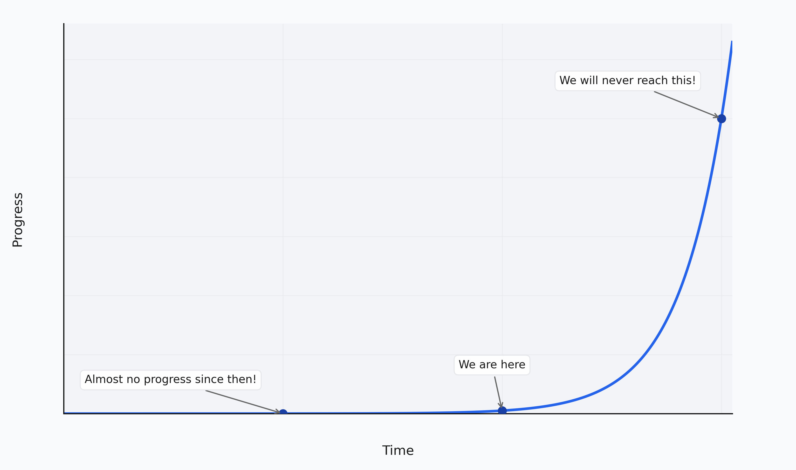

When mentioning singularity, people often think of some "point" in time when AI progress starts to speed up exponentially very quickly with no human control and it all kind of converges to infinity and we don't know what will happen the second after. And I myself had a similar picture in my head too, until recently.

I was thinking that predicting anything after 2027 is impossible because of this "singularity" that I thought would happen in that period. I decided that I should not plan anything long-term and just focus on short-term decisions, while leaving the rest as is. And I kind of did not get why OpenAI is planning moves for several years ahead like nothing changes even though they seem to believe in ASI. But now I have changed my understanding of it. There will be no singularity. You can plan for years ahead, as before. Everything will go just as expected on the scale of humanity.

There is a 4-month-old post by Sam Altman, [The Gentle Singularity](https://blog.samaltman.com/the-gentle-singularity). He talks about how the singularity won't be a certain point but gradual progress. And here's a quote I'd like to highlight right now:

> We are climbing the long arc of exponential technological progress; it always looks vertical looking forward and flat going backwards, but it’s one smooth curve.

I kind of understood it on the first read, but not all the dots did connect in my head at the time.

The key is that you should not think of AI as some non-canonical event. This is just one of the many steps humanity takes while progressing. It will speed up the overall technological progress significantly, but it's just the same as other major advances did. From paper to the worldwide web. All major advances sped up the overall progress, but that is just how exponential progress works. New advances speed up the progress towards more advances. AI is not an exception to the overall trend here, even though it can feel like one.

We won't enter a singularity in a way some people think. It all will be just as usual. New advances will happen every day, same as now. The progress will speed up, same as it always did. The whole "self-evolving AI" thing is no different from, for example, how the existence of the internet allows improving the internet itself.

To make it all more clear, you can think of an actual exponent. You can pick three points and scale the chart in a way that makes it feel like the last point is "far away" from the previous two, and that the difference between these first two points is minimal compared to the last. We are at that middle point right now. And we are always on it. Whatever we imagine to happen 10 years from now feels much less realistic than whatever happened in the last 10 years. And that's normal.

Then, if you move through that exponent, what felt "impossible" now stays on the left tail and feels like it's not that significant. And again, new possibilities open for future advances that again feel much harder to achieve than before. But actually it's all just how it naturally works. And that is what humanity has always experienced.

And there is some chance an evil ASI kills humanity, for sure. But there was that chance with many major advances, like when humans made an atomic bomb. And it never stopped humanity from moving forward. There's no point in stopping. We should keep accelerating while considering all the risks.
