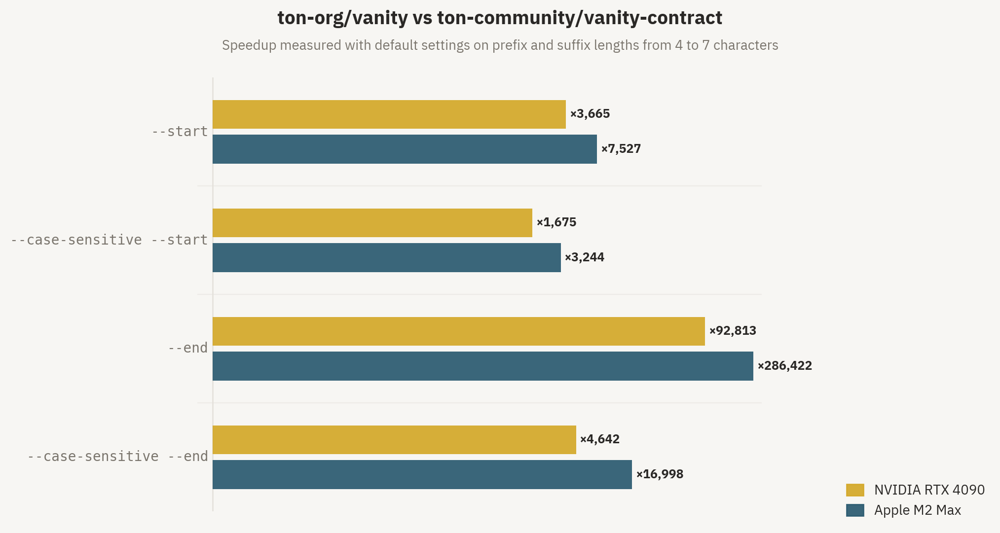

TL;DR

- Up to 286,000x faster than the previous tool
- AI wrote 100% of the code and suggested non-trivial optimizations
- [ton-org/vanity](https://github.com/ton-org/vanity)

## Motivation

Vanity addresses are addresses that spell something — like ending in `gusarich` or starting with `AAAA`. People want them for branding, for flexing, or just because it looks cool.

This tool could also be used for address poisoning — generating lookalike addresses to scam people. But bad actors always figure it out anyway. I built this so regular people can mine a vanity address without the headache.

Before TON Vanity, the most popular solution for vanity address generation on the TON blockchain was [ton-community/vanity-contract](https://github.com/ton-community/vanity-contract) since 2022. It was the first one designed to work with arbitrary smart contracts, not only wallets.

The old tool was working fine, without major bugs. Regarding speed, there were no alternatives so there was nothing to compare it with. But it was clear it could become faster.

## Background

A _vanity address generator_ is a tool that generates blockchain addresses matching specified patterns and allows deploying a smart contract on that address. These generators are common across various blockchains, and TON is no exception. An example of a vanity address is `EQBt0NZCTXHME9n4mdRh_Q_UtDOf6Xe5AmM-zVvigusArIch`. It was generated with the requirement of a `gusarich` case-insensitive suffix. It is possible to search for arbitrary letters, as addresses in TON are base64-encoded.

In TON, there is also a difference between approaches for vanity addresses, depending on the use case. When the generated address is supposed to be used as a wallet address, the mnemonic or private key is iterated so that the result can be used in any wallet app. But a more common use case is customizing smart contract addresses. This was the approach for the old tool and this is the approach for TON Vanity too.

The address of a TON account is derived from the *representation hash* of its `StateInit`, which is a data structure containing five optional fields: a 5-bit `fixed_prefix_length`, a 2-bit `tick:Bool tock:Bool` structure called `special`, a cell `code`, a cell `data`, and a cell `library`. In practice, most smart contracts only use `code` and `data`, but in some cases `fixed_prefix_length` and `library` are also used for advanced features. The `special` field is intended for system smart contracts, but can be set to anything for regular smart contracts.

*Representation hash* is not a straightforward SHA256 over the data, but rather SHA256 of its *representation*, which also includes metadata about the cell and hashes of its children (which are `code`, `data`, and `library` in case of `StateInit`). The detailed description is available in blockchain documentation, but briefly: the first byte of the representation encodes the number of children of a cell, the second encodes the number of data bits, next come the data bytes of the cell, then 16-bit depths of every child, and finally 256-bit representation hashes of every child. The bytes composed in this process are then hashed with regular SHA256 and the result is called *representation hash*.

The *user-friendly* address is then composed as follows: 1 byte of flags, then 1-byte workchain ID, then 32-byte `StateInit` hash, and finally a 2-byte CRC16-CCITT checksum for validation. These bytes are then converted to base64 to get something like `EQBt0NZCTXHME9n4mdRh_Q_UtDOf6Xe5AmM-zVvigusArIch`. This is the final result we're after.

To sum up: in order to calculate an address of an account, you take its code, data, and other `StateInit` fields, use them to compose the *representation* of the cell, hash that representation, compose a *user-friendly* address from that hash and a few other fields, and convert it to base64.

## The old tool

As mentioned in [Background](#background), before TON Vanity, the de facto standard for vanity addresses of arbitrary contracts on TON was [ton-community/vanity-contract](https://github.com/ton-community/vanity-contract).

It introduced the now-common pattern:

- The `code` is a constant that does nothing but replace the account's own code and data with whatever is provided in the very first transaction, so that any smart contract can be "deployed" on a vanity address
- The `data` contains `owner` for validation and `salt` for mining hashes
- The `salt` is mined off-chain with a GPU tool until the `StateInit` produces an address with the desired prefix or suffix

TON Vanity keeps the same usage pattern and deployment flow, but replaces all the logic under the hood, in both the smart contract and the kernel.

To better understand the optimizations, let's first look at how the old tool was implemented under the hood to see what we're competing with.

### Code

The smart contract code is pretty short:

```func
(int) slice_equal(slice s1, slice s2) asm "SDEQ";

() recv_internal(cell in_msg_cell, slice in_msg) impure {
    ;; Parse data
    var ds = get_data().begin_parse();
    ds~skip_bits(5); ;; Padding
    var owner = ds~load_msg_addr();
    ds~skip_bits(256);
    ds.end_parse();

    ;; Parse message
    var cs = in_msg_cell.begin_parse();
    var flags = cs~load_uint(4);  ;; int_msg_info$0 ihr_disabled:Bool bounce:Bool bounced:Bool
    slice sender = cs~load_msg_addr();

    ;; Allow deployment only to owner
    throw_unless(8, slice_equal(sender, owner));

    ;; Set code and data
    var code = in_msg~load_ref();
    var data = in_msg~load_ref();
    in_msg.end_parse();
    set_code(code);
    set_data(data);
}
```

It loads its own data, parses `owner` from it, then parses `sender` to get the address of the deployer, asserts their equality, and finally takes the new `code` and `data` and replaces itself with them.

Seems simple and efficient. When compiled, it ends up as just two constant cells:
```text
x{FF00F4A413F4BCF2C80B}
 x{D3ED44D075D721FA408307D721D102D0D30331FA403058C705F288D4D4D101FB04ED54}
```

### Data

The data layout also seems clear. It sums up to 528 bits, which fits into a single cell (the limit is 1023 bits per cell):

- 5-bit padding
- 267-bit owner address
- 256-bit salt

So, for the smart contract, only `data` ever changes. As a result, the old tool can pre-hash the constant `code` and compose a *template* for the `StateInit` representation, where only the `data` hash has to be replaced on every iteration.

The `StateInit` representation looks like this:

```text
020134000100009b598624c569108630d69c8422af4b5971cd9d515ad83d4facec29e25b2f9c75d7c2f9ece11a5845e257cc6c8bd375459059902ce9f6206696a8964c5e7e0781
```

The `02` is the number of children this cell has, in this case representing `code` and `data`. The `01` means that there is less than a single byte of data in this cell, because fields like `fixed_prefix_length` aren't set in the old tool.

The `34` is the data itself, being bits `00110` (the last `1` and trailing `0` are removed), representing the absence of `fixed_prefix_length`, `special`, and `library`, and the existence of `code` and `data`.

The `0001` is the depth of the first child `code`, and `0000` is the depth of the second child `data`. Then 256-bit hashes of code and data follow as `9b598624c569108630d69c8422af4b5971cd9d515ad83d4facec29e25b2f9c75` for `code` and `d7c2f9ece11a5845e257cc6c8bd375459059902ce9f6206696a8964c5e7e0781` as a placeholder for `data`.

This all sums up to 71 bytes, with non-constant data being bytes 40-71, where the `data` hash is placed. That hash itself also has to be computed over the representation, which looks like this:
```text
008404007be1eadead05ee58294a07323e2d41d8c41b456f11e5c116ff93aec8ed311d99546b0298521c095a2b125870d0219215944802604a87efa019d096254df4f315
```

The `00` means no children, `84` encodes the 66-byte length of the data, `04007be1eadead05ee58294a07323e2d41d8c41b456f11e5c116ff93aec8ed311d99` is 5-bit padding and `owner` address, and `546b0298521c095a2b125870d0219215944802604a87efa019d096254df4f315` is the 32-byte salt.

It sums up to 68 bytes total, with non-constant data being bytes 37-68, the salt. Now we have everything needed to compute the representation hash of the whole `StateInit`.

That hash is computed as SHA256, in 64-byte blocks. Both `data` and `StateInit` representations occupy two such blocks, and their non-constant data overlaps between two blocks. This forces the implementation to compute **4** blocks of SHA256 per iteration.

### Kernel

The kernel itself in the old tool is pretty trivial and mostly does everything straightforwardly. It iterates the salt, computes the representation hash of `StateInit`, builds a user-friendly address, encodes it as base64, and checks the conditions provided by the Python script.

There are a couple of bugs in the kernel related to salt iteration. One where it keeps XORing the salt with the counter on every iteration as `^=`, mutating the salt. As iterations simply increment, it ends up generating repeated salts on different iterations, slowing down the mining.

The second bug is a mismatch in salt calculation between the Python script and the kernel, where the Python script does XOR on the salt just once while the kernel does it cumulatively on every iteration, often resulting in mismatches that also slow down the mining.

## Goals

I wanted to see how fast I could make this thing. That was my primary goal.

But it also had to actually work. The old tool had a weird behavior where it was generating "misses". It had checks for these, so they didn't get to the end user, but it was just wrong that the kernel produced invalid results.

The old tool also had rough UX. It's mostly because it was developed years ago and a lot has changed in TON since then, but I still wanted to rethink the usage.

## Architecture

The system consists of a **generator** and a **smart contract**, similar to the design of the old tool. The intent was to not change the high-level architecture because it's pretty simple already and it works.

The smart contract is intentionally kept minimal for smaller size and lower deployment fees. The logic doesn't have to be complex here anyway. The whole purpose of the smart contract is to check that it is being deployed by the expected account (owner), and immediately replace its own code and data with ones provided by that account.

The generator consists of a Python script and an OpenCL kernel. The old tool used OpenCL for better compatibility, and I decided to use it here too for the same reason. There is an idea to implement kernels for different types of devices, like one for CUDA, but it's not a priority, as OpenCL already delivers good performance and maintaining multiple kernels would be harder.

The Python script acts as an entry point with a CLI. It takes parameters from the user and runs the kernel. It composes a set of conditions for individual bytes that are embedded into the kernel. It might look like this example for a case-insensitive `abc` suffix:

```text
(result[45] == 'a' || result[45] == 'A') && (result[46] == 'b' || result[46] == 'B') && (result[47] == 'c' || result[47] == 'C')
```

## Optimizations

### The rewrite

The first thing I did was rewrite the whole implementation from scratch, with a focus on correctness, to get rid of the bugs mentioned in [Kernel](#kernel). This step also made many kernel-specific things faster, but there were no novel idea-driven optimizations. Mostly routine things like faster SHA256 and CRC16, more efficient data manipulation, more unrolling.

There are many small things that differ between the old tool and the first version of TON Vanity, and I won't go deeper into them as they're not that interesting. This rewrite led to about **10x speedup** already, without any architectural differences.

### Smaller salt

Since the `data` representation occupies 68 bytes, which is very close to the 64 bytes that would fit into a single SHA256 block, the next easy thing to do is to make the salt 16 bytes instead of 32.

This decreases the data size from 528 to 400 bits and the representation size from 68 to 52 bytes. So it fits into a single SHA256 block and makes the total number of blocks 3 instead of 4, leading to about **33% speedup**.

### Dropping the data cell

The next step was to rework the smart contract. There's not much to optimize from the computational perspective of the contract itself, but changing something in the *way* it works would allow making the generator faster.

As described in [Data](#data), in the old tool the `StateInit` representation occupied 71 bytes, which doesn't fit in one SHA256 block. This includes 34 bytes per child, and the two children of `StateInit` were `code` and `data`. This means that if we get rid of one of these, we would save 34 bytes and make it fit into just one SHA256 block.

The solution was to embed `owner` and `salt` right into the `code` cell, so that we don't need to use `data` for that. The full new code looks like this:

```fift
11 THROWIF
INMSG_SRC
x{FFFFFFFFFFFFFFFFFFFFFFFFFFFFFFFFFFFFFFFFFFFFFFFFFFFFFFFFFFFFFFFFFFF_} PUSHSLICE
SDEQ 801 THROWIFNOT
LDREF LDREF DROP c4 POP SETCODE
RET
x{0000000000000000FFFFFFFFFFFFFFFFFFFFFFFFFFFFFFFF} s,
```

It is written in assembly, but it's small enough to understand without diving too deep into TVM.

`11 THROWIF` asserts that the contract is being executed as a result of receiving an internal message. This has nothing to do with the optimization and is just specific to smart contracts in TON.

The sequence `INMSG_SRC x{FF...FF_} PUSHSLICE SDEQ 801 THROWIFNOT` takes the `sender` (deployer) address and compares it with a "hardcoded" one representing `owner` that is just a placeholder here containing 267 `1` bits. If they don't match, it throws.

`LDREF LDREF DROP c4 POP SETCODE` loads two cells (`LDREF`) from the incoming message and sets them as data (`c4 POP`) and code (`SETCODE`). This is the same logic as in the old tool.

And then we have `RET` to stop the execution there, and finally another "hardcoded" slice `x{0000000000000000FFFFFFFFFFFFFFFFFFFFFFFFFFFFFFFF} s,` that is simply appended to the code cell. Zeros in the beginning are padding. Even though it is not actually code that can be executed, since it's going after `RET` it doesn't affect the execution.

So, this code compiles into something that looks like this:
```text
x{F24BF8928D087FFFFFFFFFFFFFFFFFFFFFFFFFFFFFFFFFFFFFFFFFFFFFFFFFFFFFFFFFFFFFFFFFFCC705F2E321D4D430ED54FB04DB300000000000000000FFFFFFFFFFFFFFFFFFFFFFFFFFFFFFFF}
```

There are 624 bits total, and the layout can be decomposed into:

- 50-bit constant `0x3c92fe24a3421`
- 267-bit owner address
- 179-bit constant `0x4c705f2e321d4d430ed54fb04db300000000000000000`
- 128-bit salt

When building the representation for hashing, only two descriptor bits are added apart from the data bits themselves, and in any case we get a byte sequence looking like `...[owner address]...[salt]`.

What's nice about it is that the owner address can be treated as a constant too, and what's left is exactly 64 bytes of "constant prefix" and then 16 bytes of salt. This doesn't make the `code` cell representation fit into one SHA256 block, but it makes the layout be one constant block that we can precompute and then one block with just salt.

Now, to get the hash of the `StateInit` on every iteration we only have to calculate two blocks of SHA256: one with salt within the `code` and one for `StateInit` itself, which also fits into a single block since we removed the `data` cell. This leads to about **50% speedup**.

### Free prefix bits

The purpose of the `fixed_prefix_length` field in `StateInit` is to allow smart contracts to be deployed on addresses with some constant prefixes.

For example, you can deploy an arbitrary smart contract and make its address start with `FF` by simply setting `fixed_prefix_length` to `8` and using an `FF`-prefixed address for deployment. It sounds very similar to what we want to achieve here anyway, it just works differently.

With vanity we're just trying to iterate random addresses until we hit a pattern we're looking for. And `fixed_prefix_length` works natively, as a feature of the blockchain itself.

It is limited to just 8 bits of prefix you can "override", but it's still significant considering that each bit doubles the number of iterations we would need to perform to find a certain prefix.

An obvious thing to do is to just utilize this feature to its fullest. Whenever a user wants to look for prefix patterns, we get 8 bits "for free". For example, if a user wants an `ABCD` prefix, we can get `AB` with that fixed prefix, and only look for the `**CD` prefix pattern.

This is very simple to implement, and the old tool didn't use this because at the moment of its release there was no such feature in the blockchain.

As a result, all prefix searches are instantly **sped up by 256x**.

### Iterating StateInit fields

How could we further reduce the number of blocks needed to be computed on every iteration? Could we iterate something within `StateInit` itself, rather than in its children like `code`? Yes. We can set different values for the `fixed_prefix_length` and `special` fields.

How many iterations can we make by only changing `StateInit` and not touching `code`? We have to look at what values these fields can take.

`fixed_prefix_length` is a 5-bit integer in nature, but values that can be used for deployment are limited to 0-8. Plus there's a position when this field is "absent", same as in the old tool. So, we have a total of 10 possible values.

`special` is a structure with two booleans, plus there is also an "absence" position, so we get 5 possible values from it.

Multiplying these, we get 50 different variations of `StateInit` that lead to new addresses, without changing and rehashing `code` at all. But remember that for prefixes we used `fixed_prefix_length` as intended in [Free prefix bits](#free-prefix-bits), setting it to 8 to get maximum possible "free" bits? So for prefixes, we can only iterate the `special` field and therefore get 5 different variations. Still good.

What do these iterations give us? For every 50 (or 5 for prefixes) iterations we only have to recompute the `code` hash once, meaning that in *most* of the iterations we only recompute a single SHA256 block for the `StateInit`. This leads to about **67-96% speedup**, depending on whether prefix or suffix is being searched.

### Finding suffix with prefix

For prefix patterns we just use the fixed prefix as "free" bits that we don't have to mine. But we can benefit from that for suffix patterns too.

Since fixed prefix basically allows setting the first 0 ≤ N ≤ 8 bits to anything we want, we can iterate these bits too, changing the hash part of the user-friendly address and as a consequence the 2-byte CRC16 checksum at the end of it.

What we can do is always set `fixed_prefix_length` to 8, and then for every iteration that we were doing before, ignore the last 16 bits of the address. If the remaining bits match, we can then iterate 256 possible fixed prefixes, only recomputing the cheap CRC16, and hope for a match of those last 16 bits.

This reduces the number of bits we need to mine with SHA256 by 16, but on every "hit" we have to hope for a match with 1/2^16 chance in 2^8 cheap CRC16 iterations. It all sums up to about **256x speedup** for suffixes.

## Benchmarks

While working on all the optimizations described earlier, it became clear that some kind of benchmarking suite was needed. I decided to implement it as 20-second runs with four main configurations: case-sensitive prefix, case-insensitive prefix, case-sensitive suffix, and case-insensitive suffix.

### Normalization

Since the problem this tool solves scales in a predictable way with more mined letters, it's possible to fairly compare runs with different numbers of letters used in searched patterns.

For example, if for a 4-letter case-sensitive search it finds 100 matches per second, then it will find about 1.56 matches per second for a 5-letter pattern. Every additional case-sensitive letter divides the speed by 64, as there are that many characters in base64.

For case-insensitive patterns we divide by 32, as there are 2 satisfying letters within all 64. For simplicity, no patterns in benchmarks use digits.

With this, it became possible to use the most appropriate pattern lengths for every device or version, and then normalize them all to a single baseline.

For instance, the old tool was benchmarked with 5-letter patterns for all 4 kinds on RTX 4090, and the latest version of TON Vanity is benchmarked with 7-letter patterns already, and could be benchmarked with even 8-letter ones.

How was the number of letters to use decided? The aim was to keep these numbers in the range of tens and hundreds, so that it's (A) enough to get rid of the probability noise when there are too few hits, and (B) not bottlenecked by I/O when there are too many hits per second.

For the old tool it was trickier. The 5-letter patterns produced just about 1 hit per second, which is kind of low for this purpose. But making the patterns shorter triggered many more "misses" from the bugs in that implementation, so the results were even worse when normalized. I decided to keep it this way to make it more fair, because there was no goal of cherry-picking bad results from the old tool and good ones for TON Vanity.

### Devices

Two devices were used for benchmarking: NVIDIA GeForce RTX 4090 and Apple M2 Max, as those are what I had at home. The RTX 4090 represents GPUs well, and M2 Max shows the laptop-level improvement on Apple Silicon.

The devices were the same for all benchmarking and ran in roughly the same conditions every time. There was still some noise from run to run, but it was within 5-10% range usually, and I just ignored that for the sake of more significant improvements.

### Results

Let's look at the final results. The speedup ranges from 1,700x to 286,000x depending on the search pattern and device, but overall it means that in a reasonable time it's now possible to mine 2-3 more letters than before, which is a really big improvement for this task.

I honestly didn't expect this project to go this far in terms of speed, but there's still some juice to squeeze. Here's a cool chart.



And a table with a more detailed breakdown of specific numbers from benchmarks.

| Device | Test | Baseline | TON Vanity | Speedup |
|--------|------|----------|------------|---------|
| Apple M2 Max | Prefix, case-sensitive | 1.45 hits/s (4 letters) | 73.5 hits/s (5 letters) | **3,200×** |
| | Prefix, case-insensitive | 1.2 hits/s (4 letters) | 282 hits/s (5 letters) | **7,500×** |
| | Suffix, case-sensitive | 1.05 hits/s (4 letters) | 279 hits/s (5 letters) | **17,000×** |
| | Suffix, case-insensitive | 1 hit/s (4 letters) | 280 hits/s (6 letters) | **286,000×** |
| RTX 4090 | Prefix, case-sensitive | 0.57 hits/s (5 letters) | 14.8 hits/s (6 letters) | **1,700×** |
| | Prefix, case-insensitive | 1 hit/s (5 letters) | 115 hits/s (6 letters) | **3,700×** |
| | Suffix, case-sensitive | 0.57 hits/s (5 letters) | 41.1 hits/s (6 letters) | **4,600×** |
| | Suffix, case-insensitive | 1 hit/s (5 letters) | 90.6 hits/s (7 letters) | **93,000×** |

## Testing

Testing was an important part of the development process. It's easy to break something when optimizing, and I wanted to make sure the tool works in all cases without any issues.

I decided to implement a test matrix of many possible combinations of search parameters. More specifically:

- Prefix search only
- Suffix search only
- Both prefix and suffix search
- Pattern lengths from 1 to 4
- Case-sensitive
- Case-insensitive
- Additional address-related flags: bounceable/non-bounceable, testnet/mainnet, basechain/masterchain

This sums up to 160 scenarios total, and the whole suite runs in a few minutes, which is acceptable.

Before merging any optimization or refactor, all these tests were run to make sure no bugs leaked with the changes. And it helped a lot.

## Usage

Since improving user experience was one of the goals apart from optimizations, it took some time to polish it to be actually nice and something I'd enjoy using myself.

### CLI

The CLI is the entry point of the vanity address generator. This is what people will usually run just once every time they need to generate an address, and it's the thing that will end up running for minutes or even hours while people are waiting for the hit. It should be intuitive and robust.

#### Before

Let's see what you see when trying to run the old tool's CLI for the first time.

```bash
$ python3 src/generator/run.py --help

usage: vanity-generator [-h] [--end END] [--start START] [-nb] [-t] [--threads THREADS] [--its ITS] -w W [--case-sensitive] [--early-prefix] [--only-one] owner

Generate beautiful wallet for TON on GPU using vanity contract

positional arguments:
  owner              An owner of vanity contract

options:
  -h, --help         show this help message and exit
  --end END          Search in the end of address
  --start START      Search in the start of address
  -nb                Search for non-bouncable addresses
  -t                 Search for testnet addresses
  --threads THREADS  Worker threads
  --its ITS          Worker iterations
  -w W               Address workchain
  --case-sensitive   Search for case sensitive address (case insensitive by default)
  --early-prefix     Check prefix starting from third character (subject to some address format restrictions, fourth by default)
  --only-one         Stop when an address is found (runs until interrupted by default)
```

It's not bad, but remembering that `-nb` means non-bounceable and that `-w` is a required parameter isn't great either.

`--early-prefix` adds confusion, as it requires some background knowledge of how user-friendly addresses are structured to understand if you want or need this.

The `--threads` and `--its` options aren't really useful for real users either. And there's also no way to specify which OpenCL device to use, which could be a problem.

Let's try to run a search.

```bash
$ python3 src/generator/run.py UQBKgXCNLPexWhs2L79kiARR1phGH1LwXxRbNsCFF9doczSI -w 0 --end TEST

Searching wallets with "test" in the end
Owner:  UQBKgXCNLPexWhs2L79kiARR1phGH1LwXxRbNsCFF9doczSI
Flags:  1100
Kernel conditions: (result[44] == 't' || result[44] == 'T') && (result[45] == 'e' || result[45] == 'E') && (result[46] == 's' || result[46] == 'S') && (result[47] == 't' || result[47] == 'T')

Using device:  Apple M2 Max
Speed: 154 Mh/s, miss: 48, found: 0
/Users/daniil/Coding/vanity-contract/src/generator/run.py:118: RepeatedKernelRetrieval: Kernel 'hash_main' has been retrieved more than once. Each retrieval creates a new, independent kernel, at possibly considerable expense. To avoid the expense, reuse the retrieved kernel instance. To avoid this warning, use cl.Kernel(prg, name).
  program.hash_main(
Speed: 207 Mh/s, miss: 38, found: 0
Speed: 210 Mh/s, miss: 46, found: 0
Speed: 209 Mh/s, miss: 43, found: 0
Found:  EQCzjMjGBFH-M0_DwKIZKr_CJG8JKQ4MC7blDvC8ufAwtEST salt:  ac695538eeec798a5e5e4ed02c1ff75df536dc6b74fecab770944bea7a477e3c
Speed: 194 Mh/s, miss: 49, found: 1
Found:  EQDuDQqSsiNtGMmafGyEqlIV0buM7bpoHe6tQ0Kn8n4TTEST salt:  52a0579428a17357738c66082d9e964b89a2b19f2645ab26b91954d76f9f30c8
Speed: 210 Mh/s, miss: 31, found: 2
Found:  EQBFN_xWq553JcNF2xZHrxs3R51l7YBk7OgsBte_bqOEtESt salt:  031c9acf9f89011a07f209d329669ff52daff7880c4b995750ffc92c551725a7
Speed: 196 Mh/s, miss: 51, found: 3
```

It prints some "Flags" and "Kernel conditions", then comes a warning about the kernel, and finally we see the mining process.

It instantly starts getting some "misses" and finds a few matches, printing these addresses and salts right away.

It also writes a `found.txt` file with these results:

```text
EQBFkluxbeLY5oW5ulipdt-c97H4HYeX9qk5cgbQgTWyTEst 0d2371ce4c547e2ff77b8f826d4a8a595551b46b2cb34413828caac5d16f7bd0
EQDpedDzCLSaGzoJLenBsQJv3d4noJdGoVdn6ZO86dlatEst 525d9983a3165e9aaa240c82c0e2b69f68cdae8cd64af935dc347fed71fe4b0d
EQCw5ZvzVRLkE8WtfBIWy5tfc-zaaAxVLZQ4RnAjDxoATesT b2be721cb54d09a3970cd42a295be3ad330039cfe257285f4567bd7ea25b5a38
```

That's mostly good, not really bad, but clearly some things aren't polished the way they should be.

#### After

Let's run TON Vanity's CLI.

```bash
$ python3 src/generator.py --help

usage: vanity-generator --owner OWNER [--start PREFIX] [--end SUFFIX] [options]

Generate beautiful TON wallet addresses on GPU using the vanity contract.

Options:
  -h, --help            show this help message and exit
  -o, --owner OWNER     Base64url owner address for the vanity contract
  -s, --start START     Address prefix to match, base64url
  -e, --end END         Address suffix to match, base64url
  -m, --masterchain     Use masterchain (workchain -1) instead of basechain
  -n, --non-bounceable  Search for non-bounceable addresses instead of bounceable
  -t, --testnet         Search for testnet addresses
  --case-sensitive      Treat prefix/suffix matching as case-sensitive
  --only-one            Stop after the first matching address is found
  --devices DEVICES     Comma-separated OpenCL device ids to use (see device list printed on startup)
```

That's cleaner. No short name mess, and no useless options. Also `--devices` lets you choose specific OpenCL devices.

Let's try to run a search.

```bash
$ python3 src/generator.py --owner UQBKgXCNLPexWhs2L79kiARR1phGH1LwXxRbNsCFF9doczSI --end TEST

Using device: [0] Apple M2 Max
Found 1,024, 30.59B iters/s
Found 2,048 (1,255.04/s), 30.92B iters/s
Found 3,072 (1,257.18/s), 31.07B iters/s
Found 4,096 (1,258.83/s), 31.16B iters/s
Found 6,144 (1,259.21/s), 31.21B iters/s
Found 7,168 (1,259.11/s), 31.23B iters/s
Found 8,192 (1,259.59/s), 31.26B iters/s
```

That's clean. We see the device used and its ID, then how many matches it finds and the rate per second, as well as the hashrate.

The results end up in `addresses.jsonl`, in the following format:

```json
{
    "address": "EQCW2r2pPh57Zk348FU3FCrIDF4ZljEeSzEHqj3rWmtPteSt",
    "init": {
        "code": "te6ccgEBAQEAUAAAnPJL-JKNCGACVAuEaWe9itDZsX37JEAijrTCMPqXgvii2bYEKL67Q5zHBfLjIdTUMO1U-wTbMAAAAAAAAAAA2YtH21-w7UCEMG5QVYRb9g==",
        "fixedPrefixLength": 8,
        "special": null
    },
    "config": {
        "owner": "UQBKgXCNLPexWhs2L79kiARR1phGH1LwXxRbNsCFF9doczSI",
        "start": null,
        "end": "TEST",
        "masterchain": false,
        "non_bounceable": false,
        "testnet": false,
        "case_sensitive": false,
        "only_one": false
    },
    "timestamp": 1767359422.402671
}
```

It stores the ready-to-use `init` object, as well as the `config` with settings used for the search, and a timestamp. You don't have to think about the salt yourself.

What if we search for something more rare that won't be found instantly? With the old tool it would just run with 0 hits and a bunch of misses, leaving you clueless about how long you would need to wait. Attempts to calculate it yourself would end up bad too, because of the misses.

Let's try this with TON Vanity.

```bash
$ python3 src/generator.py --owner UQBKgXCNLPexWhs2L79kiARR1phGH1LwXxRbNsCFF9doczSI --end VERYLONG  

Using device: [0] Apple M2 Max
Found 0, 334.48B iters/s, ETA 2.4s
Found 0, 333.20B iters/s, ETA 1.4s
Found 0, 334.94B iters/s, ETA 0.3s
Found 0, 334.37B iters/s, ETA 0.0s
Found 0, 335.51B iters/s, ETA 0.0s
Found 1, 335.20B iters/s
```

It instantly shows you the ETA that actually tells you how long you should wait. Obviously it can't calculate the exact moment, because it's all random under the hood, but on average you can get a good estimate from it. This is much more convenient.

### Deployment

After you've mined the address and have a JSONL ready, the next step is to use it. These addresses are mined to deploy smart contracts on them.

This step could be executed just once in some cases, when all you need is to deploy a ready smart contract. Or maybe you want to use it in your testing suite. Either way, this step should be very clear and easy to integrate.

#### Before

Let's see what the README of the old tool gave as an example of deployment.

```ts
import qs from 'qs';
import { Address, beginCell, Cell } from 'ton';

const salt = '<salt>';
const owner = Address.parse('<owner>');
const targetAddress = Address.parse('<address>');
const testnet = true;

// Vanity contract code and data
const vanityCode = Cell.fromBoc(
  Buffer.from('te6ccgEBAgEAMgABFP8A9KQT9LzyyAsBAEbT7UTQddch+kCDB9ch0QLQ0wMx+kAwWMcF8ojU1NEB+wTtVA==')
)[0];
const vanityData = beginCell()
  .storeUint(0, 5)
  .storeAddress(owner)
  .storeBuffer(Buffer.from(salt, 'hex'))
  .endCell();
let msg = new StateInit({
  code: vanityCode,
  data: vanityData,
});
let cell = new Cell();
msg.writeTo(cell);
let vanityInit = cell.toBoc({ idx: false }).toString("base64");

// Your contract code and data
const code = Cell.fromBoc('....');
const data = Cell.fromBoc('....');
const deployMessage = beginCell()
  .storeRef(code)
  .storeRef(data)
  .toBoc({ idx: false })
  .toString("base64");

// Create and display link
let link = `https://${testnet ? 'test.' : ''}tonhub.com/transfer/` + targetAddress.toFriendly({ testOnly: testnet }) + "?" + qs.stringify({
  text: "Deploy contract",
  amount: amount.toString(1),
  init: vanityInit,
  bin: deployMessage,
});
console.log("Deploy: " + link);
```

Even ignoring the fact that it uses a very old version of the `@ton/ton` library, this whole thing is really outdated, with walls of `beginCell()` calls and deployment via link.

#### After

How does it look now? You just do what you've always been doing, which is using Blueprint and Sandbox for deployment and testing, and apply vanity in a couple of lines:

```ts
const found = '{...}';
const vanity = Vanity.createFromLine(found);

const example = Example.createFromConfig(...);

const exampleWithVanity = vanity.installContract(example);

// use `exampleWithVanity` the same way as you would use `example` for testing and deployment
```

This gives you an `exampleWithVanity` wrapper that you can use whenever you would use your original `example` contract. You can run tests as-is, deploy it the same way as before, and all you need to do is pass the JSONL line to `createFromLine`.

The goal was to make it drop-in with existing tooling and libraries. The vanity wrapper handles all the `StateInit` magic, adding `fixed_prefix_length` and other fields, and managing the address rewrite.

## What's next

This project took a few weeks to complete, and I'd say it's done and ready to use. But there are still some things that could be improved further.

### Performance

There were many interesting optimizations already, but it's definitely not the end. Two key ideas are:

- Better per-device parameters, as the current defaults are mostly *random*
- Native kernels for CUDA and Metal for even better performance on those devices

### Packaging

The current implementation requires you to clone the repository to run the generator, and copy the `Vanity.ts` wrapper file into your projects to use it.

The clear next step is to publish the generator as a Python package, so that you can just `pip install` it and run. And to integrate the vanity wrapper into the `@ton/ton` library by default, so that you can import it from there directly without having to use external files.

## Appendix: Building with AI

AI wrote 100% of the code in this project and suggested non-trivial domain-specific optimizations. I wanted to share a bit about how I was using it, what it helped with a lot, and what the tough points were.

**GPT-5.1-Codex-Max** with highest reasoning effort was used in **Codex CLI**, and **GPT-5.1 Pro** was used in **ChatGPT**. This is my usual workflow — use the heavy "pro" version for deep thinking over a lot of context, and the Codex model for implementation. To understand my pick better, check out the [What LLM to use today?](https://gusarich.com/blog/what-llm-to-use-today/) post.

### AI suggested the key optimization

At first I expected LLMs to mostly help with the implementation and OpenCL kernel micro-optimizations that didn't require any architectural thinking.

But the moment that surprised me was when **GPT-5.1 Pro** suggested the [Finding suffix with prefix](#finding-suffix-with-prefix) optimization. It is a significant optimization, and it's really domain-specific and non-trivial.

I didn't give it any hints at all, and the prompt mostly had a form of "Suggest optimization ideas for the code".

LLMs aren't gods and won't just solve whatever problem you throw at them, but sometimes just giving it a shot can lead to nice results. You don't really lose anything but have a chance of solving it.

### Who did what

All the kernel-related stuff I mentioned in [The rewrite](#the-rewrite) was done by ChatGPT and Codex. They successfully implemented the generator from scratch, making it pass all the tests and work efficiently. There was almost no friction in this process — just sometimes I had to revert whatever Codex did and tell it to do it another way if it didn't work out. Multiple times I just asked an LLM to "optimize" the code. Whether ChatGPT, Codex, or even Gemini Deep Think — it works surprisingly well.

For example, closer to the release I gave the latest version of the kernel, which was already heavily optimized, to Gemini Deep Think, just to see what it could do with it. It delivered a [PR](https://github.com/ton-org/vanity/pull/25) that sped up suffix patterns by about 50-70% from what was already a huge speedup. The code had to be fixed slightly by Codex, but overall it was almost ready to use.

Still, most domain-specific architectural optimizations came from humans. While [Finding suffix with prefix](#finding-suffix-with-prefix) fully originated from **GPT-5.1 Pro**, other major optimizations were proposed by humans. AI is incredibly good at working with context and reasoning about code, but it often lacks the high-level problem understanding and domain experience required to see what will work and what won't.

### What made it work

This project is very domain-specific, and the domain here is the TON blockchain, which LLMs are really bad at. This is mostly because in the past few years everything within the ecosystem, including tooling and documentation, was reworked multiple times. And until recently, there was no good documentation at all.

So, all LLMs are very bad at anything TON-specific out of the box. You have to be careful with composing context for them to give good results.

Just asking about this project by giving the code didn't usually help, as there is really a lot of context and background required to understand why it works and is implemented this way. But once you write down why things are like this, give AI the background it needs, and make your question or request clear — it shines.

The [Background](#background) and [The old tool](#the-old-tool) sections from this post are something I'd write for **GPT-5.1 Pro** as context, and also copy-paste a few related documentation pages, along with the source code of the generator.

I was only doing that within ChatGPT, as for Codex the code and my requests are the best context already. For example, when I needed to implement the TypeScript wrapper to work with an existing library, I explained my vision to Codex. It then browsed the `node_modules` directory to see the internals of those libraries, unprompted. And delivered a working solution.

When I had an idea for another architectural optimization, I discussed it with AI, and it provided actually useful feedback. But if I didn't give it enough background, it started misinterpreting my ideas.

That's why using AI as a colleague rather than just a "code-writing tool" is the way. AI is superhuman at reasoning over code but lacks the domain experience to know what's worth trying. Using AI efficiently means understanding what it can help with and what it can't.
